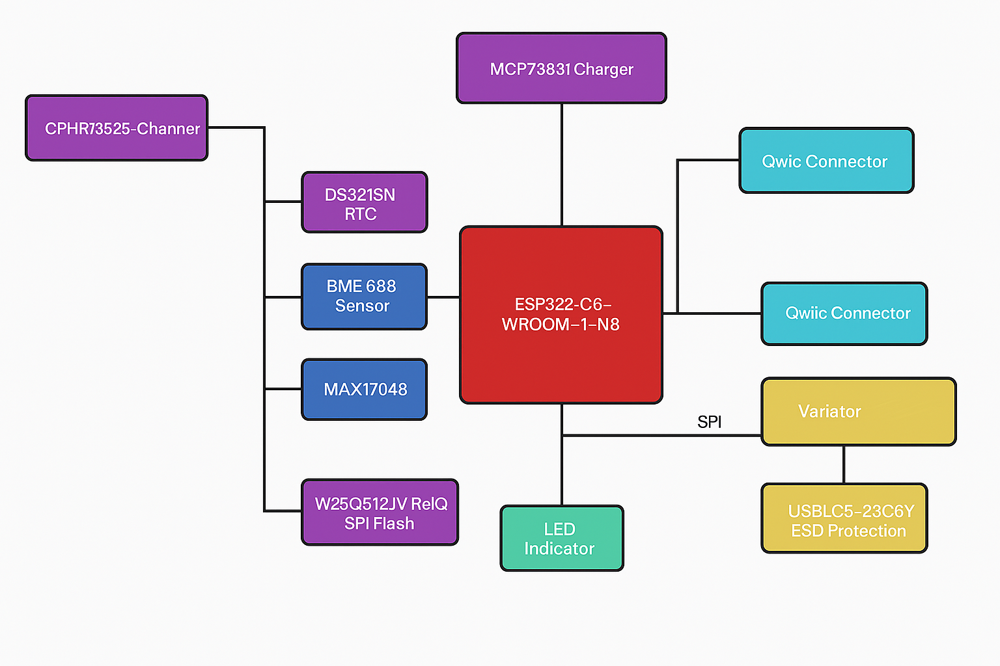

# EBookReader

Am inceput implementarea proiectului pornind de la schema electrica data in enunt. Am luat pe rand componentele din biblioteca pusa la dispozitie, apoi le-am conctat si le-am pus label-urile. Am verificat cu ERC si am rezolvat erorile, majoritatea fiind de la pini suprapusi sau etichete puse prost. Am ramas cu o eroare pe care nu am putut sa o rezolv, deoarece Fusion nu i-a detectat locatia. Odata terminata schema electrica, am facut trecut la implementarea pcb-ului. Am decupat forma dupa dimensiunile cerute si am masurat laturile. Dificultatea cea mai mare de la acest pas a constat in identificarea pieselor. Dupa amplasarea lor, am rutat si am verificat cu regulile date in enunt. Aici a fost nevoie sa modific footprint-ul bobinei L1 pentru a nu mai avea erori. La final, am facut si planul de masa atat pe top, cat si pe bottom.

---

## Arhitectură Generală a Sistemului

ESP32-C6-WROOM-1-N8 acționează ca nod central, comunicând cu toate celelalte componente prin interfețe standard (I2C, SPI, GPIO). Alimentarea este asigurată de o baterie Li-Po controlată de un încărcător dedicat și monitorizată printr-un fuel gauge.

---

## Detalii Hardware

### ESP32-C6
- Procesor RISC-V cu conectivitate Wi-Fi 6 & BLE
- Comunicare: SPI, I2C, GPIO, UART
- Tensiune operare: 3.3V

### Management Energie
- MCP73831 – control încărcare baterie LiPo
- MAX17048 – monitorizare nivel baterie cu semnal alertă
- XC6220A331MR – stabilizare la 3.3V

### Senzori și RTC
- BME688 – monitorizare temperatură, umiditate, presiune, VOC (I2C)
- DS3231SN – ceas de timp real cu alarmă (I2C)

### Display și Stocare
- E-paper display – consum redus, ideal pentru afișaj static
- W25Q512JVEIQ – memorie NOR SPI externă, 64Mbit
- SD Card – opțional, conectat prin SPI partajat

### Protecție și Conectivitate
- Protecție ESD pe linii USB (USBLC6)
- Diode Schottky pentru protecție la supratensiune
- Port USB-C pentru alimentare și comunicație serială

### Interfețe Utilizator
- Buton RESET
- LED pentru starea încărcării

---

## Alocare Pini ESP32-C6

| Componentă        | Pin ESP32 | Funcție        |
|------------------|-----------|----------------|
| BME688 – SDA     | IO8       | I2C SDA        |
| BME688 – SCL     | IO9       | I2C SCL        |
| DS3231SN – INT   | IO10      | Interrupt RTC  |
| W25Q512 – CS     | IO4       | SPI Flash CS   |
| E-Paper – CS     | IO3       | SPI Display CS |
| SPI – CLK        | IO5       | SPI Clock      |
| SPI – MOSI       | IO6       | SPI MOSI       |
| SPI – MISO       | IO7       | SPI MISO       |
| MAX17048 – ALERT | IO11      | Fuel Gauge INT |
| Buton RESET      | IO0       | Boot/Reset     |
| SD Card – CS     | IO2       | SPI CS SD Card |

---

